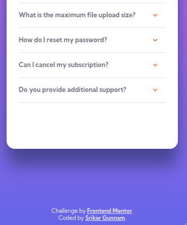

# Frontend Mentor - FAQ accordion card solution

This is a solution to the [FAQ accordion card challenge on Frontend Mentor](https://www.frontendmentor.io/challenges/faq-accordion-card-XlyjD0Oam). Frontend Mentor challenges help you improve your coding skills by building realistic projects. 

## Table of contents

  - [Overview](#overview)
    - [The challenge](#the-challenge)
    - [Screenshot](#screenshot)
    - [Links](#links)
  - [My process](#my-process)
    - [Built with](#built-with)
    - [What I learned](#what-i-learned)
    - [Continued development](#continued-development)
  - [Author](#author)

## Overview

### The challenge

Users should be able to:

- View the optimal layout for the component depending on their device's screen size
- See hover states for all interactive elements on the page
- Hide/Show the answer to a question when the question is clicked

### Screenshot

#### Mobile Preview

   

#### Desktop Preview

  

### Links

- [Solution](https://github.com/srikargunnam/frontendmentor-faq-accordion-card-main)
- [Live site](https://srikargunnam.github.io/frontendmentor-faq-accordion-card-main/)

## My process

### Built with

- Semantic HTML5 markup
- CSS & Sass
- Flexbox
- Mobile-first workflow

### What I learned

With this project I learned how to use parent & child selectors in javascript, I also learned how to use HTML _details_ & _summary_ elements, but I didn't implement it in this project as I was not aware of styling the default arrow that comes with _summary_ element.

### Continued development

I will definitely try to understand how to use custom styles for _summary_ & _details_ HTML elements and implement them in my future projects where it is necessary.

## Author

- Website - [srikargunnam.com](https://srikargunnam.com) 	🕸
- Frontend Mentor - [@srikargunnam](https://www.frontendmentor.io/profile/srikargunnam)
- Twitter - [@SrikarGunnam](https://twitter.com/SrikarGunnam)
- Codepen - [@srikargunnam](https://codepen.io/srikargunnam)
- GitHub - [@srikargunnam](https://github.com/srikargunnam/)
